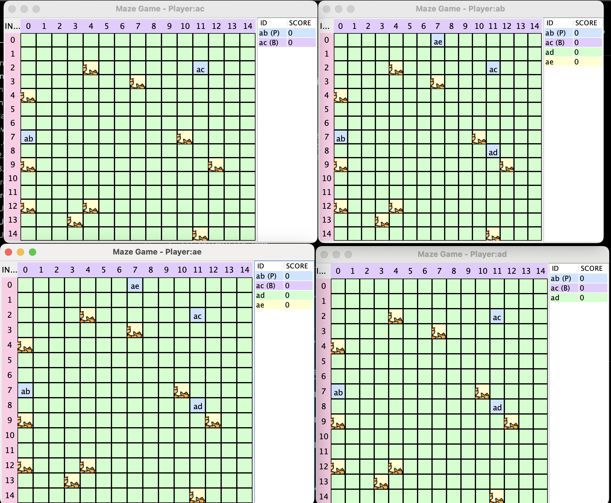

# Distributed Treasure Hunt Game

A fault-tolerant multiplayer treasure hunt game implemented using Java RMI with primary-backup architecture.


*The game interface shows a grid with players (blue cells), treasures (yellow cells with icons), and real-time scores*

---

## 🎮 Game Overview

Players move around a grid collecting treasures while competing against each other. The game features a distributed architecture with fault-tolerance mechanisms to handle player disconnections and server failures.

### Key Features

- Real-time multiplayer gameplay
- GUI interface with color-coded grid
- Primary-backup fault tolerance
- Dynamic treasure spawning
- Concurrent player movements
- Score tracking system
- Stress test support

---

## 🏗️ Architecture

### Components

#### 1. **Tracker**
   - Central registry for game coordination
   - Manages player registration
   - Reference in `Tracker.java`

#### 2. **Primary Server**
   - First player to join
   - Maintains authoritative game state
   - Handles player movements and treasure collection
   - Implementation in `Game.java`

#### 3. **Backup Server**
   - Second player to join
   - Maintains synchronized state copy
   - Takes over if primary fails
   - Failover logic in `Game.java`

---

## 🚀 Getting Started

### Prerequisites
- Java 8 or higher
- RMI registry running
- Network connectivity

### Installation

1. Compile all Java files:
   ```bash
   javac *.java
   ```

2. Start RMI registry:
   ```bash
   rmiregistry 1099
   ```

3. Start Tracker:
   ```bash
   java Tracker 1099 5 5
   ```
   Arguments: `<port> <grid_size> <treasures>`

4. Start Game instances:
   ```bash
   java Game 127.0.0.1 1099 playerName
   ```

---

## 🎯 Gameplay

### Controls
- `1`: Move West
- `2`: Move South
- `3`: Move East
- `4`: Move North
- `0`: Refresh View
- `9`: Quit Game

### Game State
The game state is managed through the `GameState` class.

---

## 🔄 Fault Tolerance

### Primary Server Failure
- Backup detects failure through pinging.
- Backup promotes itself to primary.
- New backup is assigned.
- Implementation in `Game.java`:

```java
// Example code for failover logic
if (isPrimaryDown()) {
    promoteBackupToPrimary();
    assignNewBackup();
}
```

### Backup Server Failure
- Primary detects failure.
- New backup is assigned from remaining players.
- Handled in `Game.java`:

```java
// Example code for backup failure handling
if (isBackupDown()) {
    assignNewBackupFromPlayers();
}
```

---

## 🧪 Testing

### Stress Testing

Run the stress test with the following command:
```bash
java StressTest 127.0.0.1 1099 "java Game"
```

---

## 🎨 GUI Implementation

The game features a graphical interface implemented in `GameGUI.java`.

### Features:
- Color-coded grid cells
- Real-time score display
- Player position tracking
- Treasure visualization

---

## 📦 Project Structure

```plaintext
├── Game.java         # Main game logic
├── GameState.java    # Game state management
├── GameGUI.java      # Graphical interface
├── Tracker.java      # Central registry
├── Position.java     # Grid coordinate system
├── StressTest.java   # Testing framework
└── _Interface.java   # RMI interfaces
```
